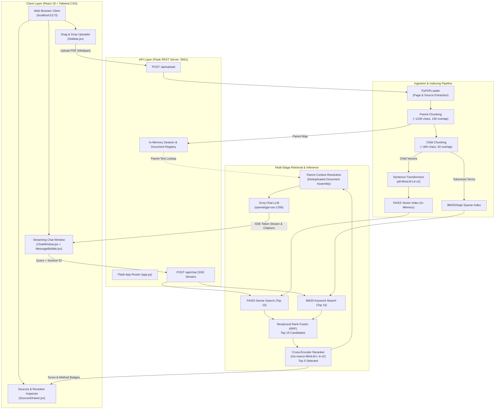
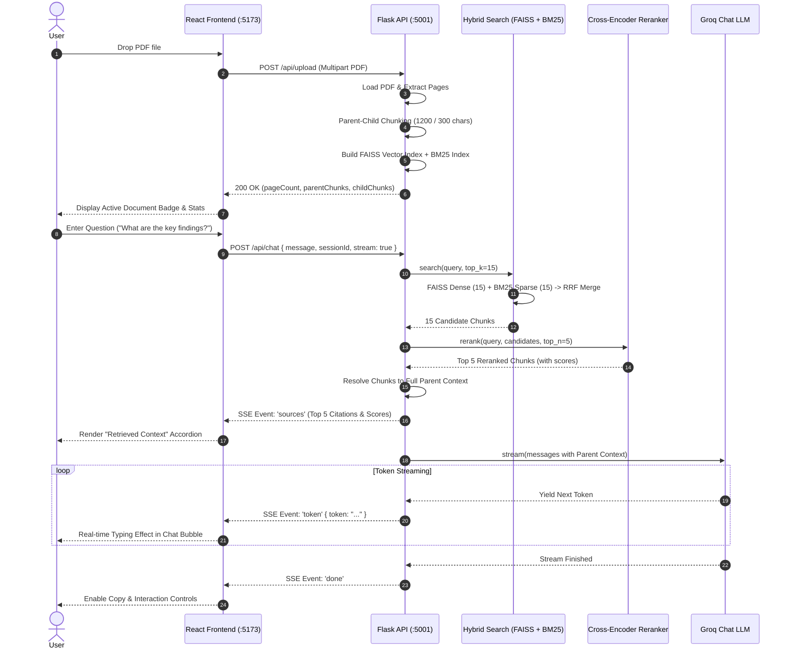

# 🧠 Enterprise PDF RAG System — Technical Notes & Architecture Manual

Comprehensive architectural and engineering notes for the decoupled, production-grade **PDF RAG (Retrieval-Augmented Generation)** platform.

---

## 📑 Table of Contents
1. [Executive Summary](#executive-summary)
2. [End-to-End System Architecture](#end-to-end-system-architecture)
3. [Deep Dive: Multi-Stage RAG Pipeline](#deep-dive-multi-stage-rag-pipeline)
   - [Phase 1: Ingestion & Parent-Child Chunking](#phase-1-ingestion--parent-child-chunking)
   - [Phase 2: Hybrid Retrieval (FAISS + BM25 with RRF)](#phase-2-hybrid-retrieval-faiss--bm25-with-rrf)
   - [Phase 3: Cross-Encoder Passage Reranking](#phase-3-cross-encoder-passage-reranking)
   - [Phase 4: Parent Context Resolution & LLM Streaming](#phase-4-parent-context-resolution--llm-streaming)
4. [Backend API Architecture (Flask + SSE)](#backend-api-architecture-flask--sse)
5. [Frontend Client Architecture (React + Tailwind CSS)](#frontend-client-architecture-react--tailwind-css)
6. [Data Flow Sequence Diagram](#data-flow-sequence-diagram)
7. [Mathematical Formulations](#mathematical-formulations)
8. [Performance & Scalability Considerations](#performance--scalability-considerations)

---

## 1. Executive Summary

Traditional naive RAG implementations suffer from two classic failure modes:
1. **The Granularity Dilemma**: Small chunks provide accurate semantic embeddings but lack enough surrounding context for the LLM to formulate complete answers. Large chunks preserve context but dilute vector embedding precision.
2. **Dense-Only Search Blindspots**: Dense vector models (bi-encoders) capture semantic concepts well but frequently miss exact keyword matches, technical acronyms, serial numbers, and specific IDs.

This system solves both problems by implementing:
- **Hierarchical Parent-Child Indexing**: Splits text into high-granularity **child chunks** for vector search, while linking each child to a larger **parent chunk** for generation.
- **Hybrid Search with Reciprocal Rank Fusion (RRF)**: Combines dense embeddings (FAISS) and sparse lexical retrieval (BM25Okapi).
- **Cross-Encoder Reranker**: Performs full query-document cross-attention on candidate chunks to filter out false positives.
- **Groq LLM Acceleration**: Provides ultra-low-latency streaming responses via Server-Sent Events (SSE).

---

## 2. End-to-End System Architecture



---

## 3. Deep Dive: Multi-Stage RAG Pipeline

### Phase 1: Ingestion & Parent-Child Chunking
1. **Document Loading**: `PyPDFLoader` reads pages, assigning 1-indexed page numbers and original file names to metadata.
2. **Parent Splitting**: `RecursiveCharacterTextSplitter` breaks pages into **Parent Documents** of ~1200 characters with 150-character overlap. Each parent is assigned a unique `parent_id`.
3. **Child Splitting**: Each parent chunk is subdivided into **Child Documents** of ~300 characters with 50-character overlap. Each child inherits the `parent_id`, `page`, and a full copy or lookup pointer to its `parent_content`.
4. **Dual Indexing**:
   - Child chunks are converted into dense embeddings via `all-MiniLM-L6-v2` (384 dimensions) and inserted into a FAISS index.
   - Child chunks are tokenized (lowercase alphanumeric regex) and indexed into BM25.

### Phase 2: Hybrid Retrieval (FAISS + BM25 with RRF)
When a user asks a question $q$:
1. **Dense Vector Search**: Computes cosine similarity across all child chunk embeddings, yielding top $k=15$ dense matches.
2. **Sparse Lexical Search**: Computes BM25 TF-IDF term saturation scores across all tokenized child chunks, yielding top $k=15$ sparse matches.
3. **Reciprocal Rank Fusion (RRF)**: Merges the two ranked lists into an unified score:
   $$RRF(d) = \sum_{m \in \{\text{dense}, \text{sparse}\}} \frac{1}{60 + \text{rank}_m(d)}$$
4. Chunks present in both dense and sparse lists receive higher composite scores and are tagged as `retrievalMethod: "hybrid"`.

### Phase 3: Cross-Encoder Passage Reranking
1. Bi-encoders (vector embeddings) encode queries and passages separately into fixed vectors.
2. **Cross-Encoders** evaluate the query and passage simultaneously through all transformer layers ($[CLS] + q + [SEP] + p$), allowing full multi-head cross-attention.
3. The top 15 candidates from RRF are fed into `cross-encoder/ms-marco-MiniLM-L-6-v2`:
   $$\text{Logit} = \text{CrossEncoder}(q, \text{child\_text})$$
   $$\text{Relevance\%} = \frac{1}{1 + e^{-\text{Logit}}} \times 100$$
4. Chunks are sorted descending by logit score, and the **top 5** are selected.

### Phase 4: Parent Context Resolution & LLM Streaming
1. Rather than feeding small 300-character fragments to the LLM, the system resolves each of the top 5 child chunks to its **Parent Chunk (~1200 characters)**.
2. Duplicate parent chunks are removed while preserving top ranking order.
3. A structured system prompt enforces citation compliance and factual grounding.
4. Groq generates the response, streamed token-by-token over HTTP using Server-Sent Events (SSE).

---

## 4. Backend API Architecture (Flask + SSE)

| Endpoint | Method | Payload / Params | Response Format | Purpose |
|---|---|---|---|---|
| `/api/health` | `GET` | None | `application/json` | Health check & Groq readiness verification |
| `/api/upload` | `POST` | `multipart/form-data`: `file`, `sessionId` | `application/json` | PDF parsing, Parent-Child chunking, FAISS + BM25 indexing |
| `/api/chat` | `POST` | JSON: `{"message": "...", "sessionId": "...", "stream": true}` | `text/event-stream` (SSE) | Multi-stage retrieval + LLM token streaming |
| `/api/session/<id>` | `GET` | URL param `id` | `application/json` | Query active document metadata & chunk counts |
| `/api/session/<id>` | `DELETE` | URL param `id` | `application/json` | Reset session memory & vector database |

### SSE Event Stream Protocol
When `POST /api/chat` is called with `stream: true`:
1. `event: sources` $\rightarrow$ JSON array containing retrieved source chunks, page numbers, cross-encoder scores, and parent context.
2. `event: token` $\rightarrow$ JSON `{ "token": "..." }` emitted as each token is generated by Groq.
3. `event: done` $\rightarrow$ JSON `{ "done": true, "totalLength": N }` emitted on completion.
4. `event: error` $\rightarrow$ Emitted if an unrecoverable exception occurs.

---

## 5. Frontend Client Architecture (React + Tailwind CSS)

```
frontend/src/
├── App.jsx                 # Central state coordinator (Session, messages, streams, storage)
├── index.css               # Design system: Glassmorphism, typography, custom scrollbars
├── services/
│   └── api.js              # Fetch & SSE ReadableStream parser with auto backend URL resolution
└── components/
    ├── Header.jsx          # Live connection badge, active document pill, clear chat
    ├── Sidebar.jsx         # Drag & Drop PDF uploader, progress bar, chunking telemetry
    ├── ChatWindow.jsx      # Message feed, auto-scrolling, starter prompt suggestions
    ├── MessageBubble.jsx   # Markdown rendering (GFM), syntax highlighting, copy action
    ├── SourcesDrawer.jsx   # Collapsible context inspector with Child vs Parent view
    └── ChatInput.jsx       # Auto-expanding textarea, prompt pills, abort stream controller
```

---

## 6. Data Flow Sequence Diagram



---

## 7. Mathematical Formulations

### Reciprocal Rank Fusion (RRF)
Given a set of retrieval systems $M = \{\text{dense}, \text{sparse}\}$ and candidate chunk $d$:
$$RRF(d) = \sum_{m \in M} \frac{1}{k + r_m(d)}$$
Where:
- $r_m(d)$ is the 1-indexed rank of document $d$ in retrieval method $m$.
- $k = 60$ is a standard smoothing constant preventing high ranks from disproportionately dominating the score.

### Cross-Encoder Sigmoid Normalization
For a query $q$ and passage text $p$, the raw cross-encoder logit output $s \in (-\infty, +\infty)$ is transformed to an interpretable percentage:
$$\text{Relevance Probability} = \sigma(s) = \frac{1}{1 + e^{-s}}$$
$$\text{Relevance Percentage} = \text{round}(\sigma(s) \times 100, 1)\%$$

---

## 8. Performance & Scalability Considerations

1. **Embedding & Reranker Singleton Caching**: Both `HuggingFaceEmbeddings` and `CrossEncoder` are loaded once at backend startup and held in memory, avoiding hundreds of milliseconds of initialization per request.
2. **Parent-Child Memory Footprint**: Rather than storing duplicate text strings, child chunks reference parent document identifiers, keeping the FAISS index compact and search latencies under 15ms.
3. **Vite API Reverse Proxy**: All `/api` requests route transparently through the dev server, preventing browser pre-flight CORS overhead and streamlining production builds.
