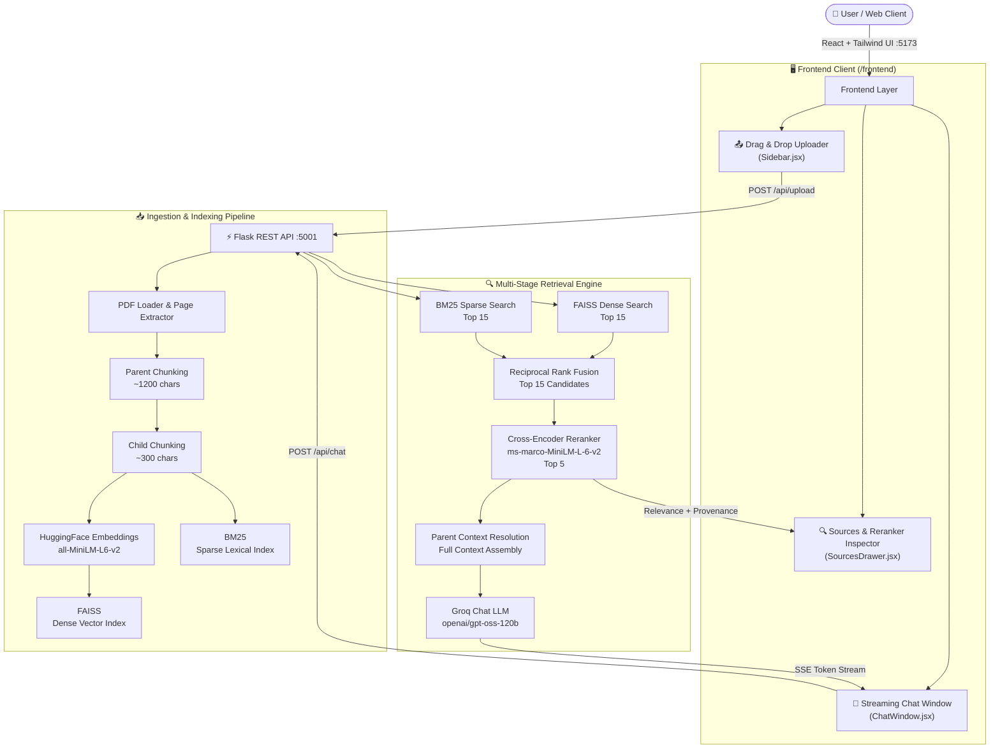

# 🤖 PDF RAG Intelligence Platform

<p align="center">
  <strong>Hybrid Retrieval • Parent-Child Context • Reranking • Streaming Generation • Retrieval Transparency</strong>
</p>

<p align="center">
  An end-to-end PDF question-answering platform that combines dense and sparse retrieval, rank fusion, cross-encoder reranking, parent-context reconstruction, and streaming LLM generation.
</p>

<p align="center">
  
  
  
  
  
  
  
</p>

---

## 📌 Table of Contents

- [Overview](#-overview)
- [Problem Statement](#-problem-statement)
- [Solution](#-solution)
- [Key Features](#-key-features)
- [Architecture](#-architecture)
- [End-to-End Workflow](#-end-to-end-workflow)
- [Document Ingestion](#-document-ingestion)
- [Parent-Child Chunking](#-parent-child-chunking)
- [Hybrid Retrieval](#-hybrid-retrieval)
- [Reciprocal Rank Fusion](#-reciprocal-rank-fusion-rrf)
- [Cross-Encoder Reranking](#-cross-encoder-reranking)
- [Parent Context Resolution](#-parent-context-resolution)
- [LLM Generation](#-llm-generation)
- [SSE Streaming](#-server-sent-events-sse)
- [Source Transparency](#-source--reranker-inspector)
- [Frontend Architecture](#-frontend-architecture)
- [Project Structure](#-project-structure)
- [Technology Stack](#-technology-stack)
- [Installation](#-installation)
- [Configuration](#-configuration)
- [Running the Application](#-running-the-application)
- [API Reference](#-rest-api-reference)
- [Automated Testing](#-automated-testing)
- [Example Usage](#-example-usage)
- [Key Design Decisions](#-key-design-decisions)
- [Retrieval Pipeline Summary](#-retrieval-pipeline-summary)
- [Performance & Scalability](#-performance--scalability)
- [Security Considerations](#-security-considerations)
- [Current Limitations](#-current-limitations)
- [Future Roadmap](#-future-roadmap)
- [Troubleshooting](#-troubleshooting)
- [Technical Documentation](#-technical-documentation)
- [Author](#-author)

---

## 🚀 Overview

The **Enterprise PDF RAG Intelligence Platform** is an end-to-end document question-answering system built around a multi-stage Retrieval-Augmented Generation (RAG) pipeline.

Users can upload a PDF and ask natural-language questions about its contents. Instead of sending the entire document directly to an LLM, the application builds searchable indexes and retrieves the most relevant passages before generation.

The retrieval architecture intentionally combines multiple techniques:

```
PDF
 │
 ▼
Page Extraction
 │
 ▼
Parent Chunks (~1200 chars)
 │
 ▼
Child Chunks (~300 chars)
 │
 ├───────────────┐
 ▼               ▼
FAISS           BM25
Dense           Sparse
Search          Search
 │               │
 └───────┬───────┘
         ▼
 Reciprocal Rank Fusion
         │
      Top 15
         ▼
 Cross-Encoder Reranker
         │
       Top 5
         ▼
 Parent Context Resolution
         │
         ▼
 Groq LLM
         │
         ▼
 SSE Token Stream
         │
         ▼
 React Chat Interface
```

The goal is not simply to make a PDF chatbot. The project focuses on the **retrieval engineering** behind reliable document QA: improving candidate recall, ranking precision, context quality, response latency, and retrieval transparency.

---

## 🎯 Problem Statement

A basic document chatbot often follows:

$$\text{PDF} \rightarrow \text{Split} \rightarrow \text{Embed} \rightarrow \text{Vector Search} \rightarrow \text{LLM}$$

While this architecture is simple, it can struggle with different types of queries:

- **Semantic queries**: A user may ask *"What recommendations are provided for improving operational efficiency?"* — the document may use completely different wording.
- **Exact-term queries**: A user may ask *"What does ISO 27001 Annex A require?"* — the exact technical terms and identifiers matter.
- **Context-dependent queries**: A retrieved sentence may not contain enough surrounding information to answer correctly.
- **Ranking problems**: The first vector-search result is not necessarily the most useful passage for the final answer.

---

## 💡 Solution

This project separates the RAG pipeline into specialized stages:

```
                    QUERY
                      │
          ┌───────────┴───────────┐
          ▼                       ▼
   Dense Retrieval         Sparse Retrieval
       FAISS                    BM25
     Top 15                    Top 15
          │                       │
          └───────────┬───────────┘
                      ▼
                RRF Fusion
                      │
                  Top 15
                      ▼
             Cross-Encoder
               Reranking
                      │
                   Top 5
                      ▼
             Parent Resolution
                      │
                      ▼
              Context Assembly
                      │
                      ▼
                  Groq LLM
                      │
                      ▼
              Streaming Answer
```

### Stage Responsibilities

| Stage | Primary Responsibility |
|---|---|
| **PDF Loader** | Extract document text and page metadata |
| **Parent Chunking** | Preserve broader context (~1200 chars) |
| **Child Chunking** | Create precise searchable units (~300 chars) |
| **FAISS** | Semantic vector retrieval |
| **BM25** | Lexical / exact-term retrieval |
| **RRF** | Combine independent ranking signals |
| **Cross-Encoder** | Deep relevance scoring & cross-attention |
| **Parent Lookup** | Restore broader document context |
| **Groq LLM** | Generate the final grounded response |
| **SSE** | Deliver the response incrementally in real time |

---

## ⭐ Key Features

- 📄 **PDF-Based Question Answering**: Upload a PDF and interact with its contents through natural-language questions.
- 🧩 **Hierarchical Parent-Child Chunking**: Small child chunks (~300 chars) improve retrieval precision, while parent chunks (~1200 chars) preserve surrounding context.
- 🔍 **Hybrid Retrieval**: Combines FAISS dense retrieval with BM25 sparse keyword retrieval for semantic and lexical coverage.
- 🔀 **Reciprocal Rank Fusion (RRF)**: Merges FAISS and BM25 rankings into a unified candidate pool.
- 🎯 **Cross-Encoder Reranking**: Ranks candidates with `ms-marco-MiniLM-L-6-v2`, selecting the top 5 passages.
- 🧱 **Parent Context Reconstruction**: Resolves child chunks back to their parent chunks before generation.
- ⚡ **Streaming LLM Responses**: Uses Server-Sent Events (SSE) for low-latency, progressive answer delivery.
- 🔎 **Retrieval Transparency**: Dedicated UI drawer exposing retrieved passages, relevance scores, page numbers, and parent/child context.
- 🖥️ **Modern Web Client**: Built with React 18, Vite, and Tailwind CSS.

---

## 🏗️ Architecture



---

## 🔄 End-to-End Workflow

- **Phase 1 — Upload**: User drops PDF into React UI $\rightarrow$ `POST /api/upload` $\rightarrow$ Flask backend starts processing.
- **Phase 2 — Extract**: `PyPDFLoader` extracts text and enriches page-level metadata.
- **Phase 3 — Chunk**: Splits text into Parent Chunks (~1200 chars) and Child Chunks (~300 chars).
- **Phase 4 — Index**: Child chunks are indexed into FAISS (dense vectors) and BM25 (sparse tokens).
- **Phase 5 — Retrieve**: Query runs concurrently against FAISS (top 15) and BM25 (top 15).
- **Phase 6 — Fuse**: Reciprocal Rank Fusion combines the two lists into top 15 candidate passages.
- **Phase 7 — Rerank**: `cross-encoder/ms-marco-MiniLM-L-6-v2` performs deep relevance scoring, choosing the top 5.
- **Phase 8 — Resolve Context**: Selected child chunks map back to their deduplicated parent chunks.
- **Phase 9 — Generate**: Groq (`openai/gpt-oss-120b`) generates a structured answer from parent context.
- **Phase 10 — Stream**: Tokens and sources stream incrementally to the React client via SSE.

---

## 📥 Document Ingestion

```
Raw PDF ──► PDF Loader ──► Page Text ──► Parent Documents ──► Child Documents ──► Embeddings + BM25 Index
```

### Why retain page metadata?
Page metadata provides end-to-end document provenance, allowing the frontend to show users exactly which page and chunk supported each claim in the generated answer.

---

## 🧩 Parent-Child Chunking

### The Granularity Problem
There is an inherent trade-off in chunk size:
- **Large chunks**: More context + Less precise retrieval
- **Small chunks**: More precise retrieval + Less surrounding context

The platform addresses this by separating the **retrieval unit** from the **context unit**:

```
                 Parent Chunk
             ~1200 characters
                     │
       ┌─────────────┼─────────────┐
       ▼             ▼             ▼
   Child Chunk   Child Chunk   Child Chunk
    ~300 chars    ~300 chars    ~300 chars
```

- **Retrieval**: Search the smaller child chunks.
- **Generation**: Resolve the relevant parent context.

$$\text{Fine-grained retrieval} + \text{Broader generation context}$$

---

## 🔍 Hybrid Retrieval

The system leverages two complementary retrieval paradigms:

### 1. Dense Retrieval (FAISS + all-MiniLM-L6-v2)
Text is converted into 384-dimensional dense vectors and indexed in FAISS.
- **Strength**: Connects concepts with different wording (e.g., *"improving employee wellbeing"* $\rightarrow$ *"measures to enhance workforce welfare"*).

### 2. Sparse Retrieval (BM25Okapi)
Text is tokenized into lexical terms and scored using BM25 frequency statistics.
- **Strength**: Exact keyword matching for identifiers, acronyms, and technical terms (e.g., *"ISO 27001 Annex A"*).

### ⚖️ Why Combine FAISS and BM25?

| Retriever | Core Strength | Primary Use Case |
|---|---|---|
| **FAISS** | Semantic similarity | Conceptual, paraphrased, exploratory queries |
| **BM25** | Exact lexical matching | Terminology, codes, acronyms, names |
| **Both (Hybrid)** | Complementary signals | Maximizes candidate recall across diverse queries |

---

## 🔀 Reciprocal Rank Fusion (RRF)

FAISS and BM25 produce scores on different scales. RRF merges them based on rank position rather than raw scores:

$$RRF(d) = \sum_{r \in R}\frac{1}{k + rank_r(d)}$$

Where:
- $d$ = candidate chunk
- $R = \{\text{FAISS}, \text{BM25}\}$
- $rank_r(d)$ = rank of $d$ in retriever $r$
- $k = 60$ (smoothing constant)

```
FAISS Top 15 + BM25 Top 15 ──► RRF scoring ──► Unified ranking ──► Top 15 candidates
```

---

## 🎯 Cross-Encoder Reranking

Retrieval is optimized for **fast candidate recall**, while reranking is optimized for **deep precision scoring**.

```
RRF Candidates (Top 15) ──► Cross-Encoder (ms-marco-MiniLM-L-6-v2) ──► Top 5 Selected
```

The Cross-Encoder computes full multi-head cross-attention over `(query, passage)` pairs, producing logit scores transformed to normalized relevance percentages:

$$\text{Relevance\%} = \frac{1}{1 + e^{-\text{Logit}}} \times 100$$

---

## 🧱 Parent Context Resolution

After reranking, the top 5 child chunks are mapped back to their parent documents:

```
Query ──► Child Match ──► Parent Resolution ──► Deduplicated Broader Context ──► Groq LLM
```

If a child chunk states `"...this policy was introduced in 2023..."`, the parent chunk provides the complete policy name, background, scope, and implementation details.

---

## 🤖 LLM Generation

The generation layer uses **Groq Chat LLM** (`openai/gpt-oss-120b` or configurable via `GROQ_MODEL`).

```
Document Evidence ──► Multi-Stage Retrieval ──► Reranking ──► Context Assembly ──► Groq LLM
```

A strict prompt forces factual grounding and direct source citations (e.g. `[Page 2, Source 1]`).

---

## ⚡ Server-Sent Events (SSE)

The chat API streams tokens in real time via Server-Sent Events:

```
Request ──► Initial Reranked Sources (event: sources) ──► Incremental Tokens (event: token) ──► Completion (event: done)
```

This ensures instant time-to-first-token and smooth interactive typing in the React client.

---

## 🔎 Source & Reranker Inspector

The frontend features an expandable **`SourcesDrawer`** component attached to every assistant response:
- **Relevance Badges**: Normalized Cross-Encoder percentage (e.g. `96.7% Relevance`).
- **Retrieval Method Provenance**: `Hybrid (FAISS + BM25)`, `Dense FAISS`, or `Sparse BM25`.
- **Page Numbers**: Accurate page attribution from document metadata.
- **Context Toggle**: Switch between **Child Chunk (Search Match)** and **Parent Context (Fed to LLM)**.

---

## 🖥️ Frontend Architecture

The frontend is a modern React 18 + Vite application styled with Tailwind CSS:

- **[Sidebar.jsx](file:///Users/roushan_iiitbgp/Desktop/Rag_Chatbot/frontend/src/components/Sidebar.jsx)**: PDF drag-and-drop zone, indexing progress bar, and chunk statistics.
- **[ChatWindow.jsx](file:///Users/roushan_iiitbgp/Desktop/Rag_Chatbot/frontend/src/components/ChatWindow.jsx)**: Conversation display, empty-state starter prompts, and auto-scrolling.
- **[ChatInput.jsx](file:///Users/roushan_iiitbgp/Desktop/Rag_Chatbot/frontend/src/components/ChatInput.jsx)**: Auto-resizing textarea, keyboard shortcuts, prompt pills, and stop controls.
- **[MessageBubble.jsx](file:///Users/roushan_iiitbgp/Desktop/Rag_Chatbot/frontend/src/components/MessageBubble.jsx)**: Markdown rendering with GitHub-flavored markdown (GFM), syntax highlighting, and copy button.
- **[SourcesDrawer.jsx](file:///Users/roushan_iiitbgp/Desktop/Rag_Chatbot/frontend/src/components/SourcesDrawer.jsx)**: Collapsible context inspector.
- **[api.js](file:///Users/roushan_iiitbgp/Desktop/Rag_Chatbot/frontend/src/services/api.js)**: API client for uploads, sessions, and SSE stream parsing.

---

## 📁 Project Structure

```
Rag_Chatbot/
├── backend/
│   ├── app.py                   # Flask REST API, SSE streaming & session routing
│   ├── requirements.txt         # Backend Python dependencies
│   ├── test_rag.py              # Automated RAG pipeline verification suite
│   └── src/
│       ├── __init__.py
│       ├── loader.py            # PDF loading & page metadata enrichment
│       ├── splitter.py          # Parent-Child document chunking hierarchy
│       ├── embeddings.py        # HuggingFace sentence-transformers singleton
│       ├── vector_db.py         # FAISS vector store & persistence
│       ├── hybrid_search.py     # BM25 + FAISS Reciprocal Rank Fusion (RRF)
│       ├── reranker.py          # Cross-Encoder (ms-marco-MiniLM-L-6-v2) reranker
│       └── rag_chain.py         # Groq Chat LLM streaming & context formatting
├── frontend/
│   ├── package.json             # React 18, Vite, Tailwind CSS, Lucide icons
│   ├── vite.config.js           # Reverse proxy configuration to :5001
│   ├── tailwind.config.js       # Glassmorphic tokens & custom animations
│   ├── index.html               # Main HTML entry point
│   └── src/
│       ├── App.jsx              # Main dashboard state coordinator
│       ├── index.css            # Custom theme & typography styling
│       ├── components/
│       │   ├── Header.jsx       # Status bar, active PDF pill & clear chat
│       │   ├── Sidebar.jsx      # Drag & drop PDF uploader & chunk telemetry
│       │   ├── ChatWindow.jsx   # Message stream & starter prompt suggestions
│       │   ├── ChatInput.jsx    # Auto-resizing input & stream stop control
│       │   ├── MessageBubble.jsx# Markdown renderer & syntax highlighting
│       │   └── SourcesDrawer.jsx# Expandable retrieved chunks & parent inspector
│       └── services/
│           └── api.js           # API client for uploads, sessions & SSE streams
├── .vscode/
│   └── settings.json            # VS Code IDE Python interpreter & extraPaths
├── run_dev.py                   # All-in-one development launcher
├── ARCHITECTURE_NOTES.md        # Deep engineering notes & mathematical formulas
├── .env                         # Environment variables (GROQ_API_KEY)
└── README.md                    # Project documentation
```

---

## 🛠️ Technology Stack

| Layer | Technologies |
|---|---|
| **Backend** | Python 3.10+, Flask, Flask-CORS, Server-Sent Events |
| **Frontend** | React 18, Vite, Tailwind CSS, Lucide Icons, React-Markdown |
| **Retrieval** | FAISS (Dense), BM25Okapi (Sparse), Reciprocal Rank Fusion (RRF) |
| **Embeddings** | HuggingFace `sentence-transformers/all-MiniLM-L6-v2` |
| **Reranking** | Cross-Encoder `cross-encoder/ms-marco-MiniLM-L-6-v2` |
| **LLM Inference** | Groq Cloud API (`openai/gpt-oss-120b` or configurable) |

---

## ⚡ Installation

### Prerequisites
- Python 3.10+
- Node.js 18+ & npm
- A Groq API key

### 1. Clone the Repository
```bash
git clone <your-repository-url>
cd Rag_Chatbot
```

### 2. Create Python Environment
```bash
# macOS / Linux
python3 -m venv venv
source venv/bin/activate

# Windows
python -m venv venv
venv\Scripts\activate
```

### 3. Install Backend Dependencies
```bash
pip install -r backend/requirements.txt
```

### 4. Install Frontend Dependencies
```bash
cd frontend
npm install
cd ..
```

---

## 🔐 Configuration

Create a `.env` file in the project root:

```env
GROQ_API_KEY="your_groq_api_key_here"
GROQ_MODEL="openai/gpt-oss-120b"
```

---

## ▶️ Running the Application

### Option A — One-Command Launcher (Recommended)
Run the launcher script from the root directory:
```bash
./run_dev.py
```

- **Frontend**: [http://localhost:5173](http://localhost:5173)
- **Backend API**: [http://127.0.0.1:5001](http://127.0.0.1:5001)

### Option B — Separate Terminals

**Terminal 1 — Backend**:
```bash
source venv/bin/activate
python backend/app.py
```

**Terminal 2 — Frontend**:
```bash
cd frontend
npm run dev
```

Open **[http://localhost:5173](http://localhost:5173)** in your browser.

---

## 📡 REST API Reference

### `GET /api/health`
Returns service health and Groq configuration status.
```json
{
  "status": "healthy",
  "service": "PDF RAG Chatbot Flask API",
  "groq_configured": true,
  "active_sessions": 1
}
```

### `POST /api/upload`
Uploads and indexes a PDF document into parent and child chunks.
- **Content-Type**: `multipart/form-data`
- **Parameters**: `file` (PDF binary), `sessionId` (optional string)

```json
{
  "success": true,
  "sessionId": "sess_8a9df201",
  "filename": "annual_report.pdf",
  "pageCount": 14,
  "parentChunks": 28,
  "childChunks": 92,
  "message": "Successfully indexed 'annual_report.pdf'"
}
```

### `POST /api/chat`
Runs the multi-stage retrieval pipeline and streams the generated answer.
- **Request Body**:
```json
{
  "message": "What were the total revenues in Q3?",
  "sessionId": "sess_8a9df201",
  "stream": true
}
```

#### SSE Stream Events:
- `event: sources` $\rightarrow$ Array of top 5 reranked source passages with scores.
- `event: token` $\rightarrow$ Next text token from Groq LLM.
- `event: done` $\rightarrow$ Stream completion signal.

---

## 🧪 Automated Testing

Run the automated RAG verification suite:

```bash
./venv/bin/python backend/test_rag.py
```

Sample test output:
```
=== 1. Testing Parent-Child Document Splitting ===
Parents generated: 3 | Children generated: 9

=== 2. Testing HuggingFace Embeddings & FAISS Vector Store ===
FAISS vector store created successfully.

=== 3. Testing Hybrid Retrieval (Dense FAISS + Sparse BM25 RRF) ===
Retrieved 5 hybrid candidates.

=== 4. Testing Cross-Encoder Reranker ===
Reranked top 3 chunks (Top score: 3.38 | 96.7% Relevance).

=== 5. Testing Parent Context Resolution ===
Resolved Parent Context preview successfully.

=== 6. Testing Groq LLM Invocation ===
Groq LLM Response: Factual cited answer generated.

 ALL PIPELINE TESTS PASSED SUCCESSFULLY!
```

---

## 💬 Example Usage

1. Upload `annual_report.pdf` using the drag-and-drop zone.
2. Ask: *"What were the total revenues in Q3?"*
3. The multi-stage pipeline executes:
   $$\text{Hybrid Search} \rightarrow \text{RRF (Top 15)} \rightarrow \text{Cross-Encoder (Top 5)} \rightarrow \text{Parent Context} \rightarrow \text{Groq Stream}$$
4. Expand the **Retrieved Context** drawer to inspect individual chunk relevance scores and toggle parent context views.

---

## 🏛️ Key Design Decisions

- **Why not Dense Only?** Keyword matching handles specific acronyms, names, and exact IDs that vector embeddings can miss.
- **Why not BM25 Only?** Dense retrieval bridges vocabulary gaps and understands semantic intent.
- **Why RRF?** Eliminates the need to normalize incompatible raw scores from FAISS and BM25.
- **Why Rerank?** Broad candidate retrieval (top 15) followed by deep cross-attention precision scoring (top 5) optimizes both recall and accuracy.
- **Why Parent-Child Chunking?** Separates retrieval granularity (~300 chars) from generation context (~1200 chars).
- **Why SSE?** Low-latency token delivery improves user experience.

---

## 📊 Retrieval Pipeline Summary

| Stage | Input | Output |
|---|---|---|
| **PDF Extraction** | Raw PDF | Page text & metadata |
| **Parent Split** | Page text | ~1200-char parent documents |
| **Child Split** | Parent chunks | ~300-char child documents |
| **Embedding** | Child text | 384-d dense vectors |
| **FAISS Search** | Query vector | Top 15 dense candidates |
| **BM25 Search** | Query tokens | Top 15 sparse candidates |
| **RRF Fusion** | Dual ranked lists | Top 15 fused candidates |
| **Cross-Encoder** | Query + Candidates | Top 5 reranked candidates |
| **Parent Resolution**| Top 5 child chunks | Full parent context blocks |
| **Groq LLM** | Context + Question | Structured cited response |
| **SSE Stream** | Generated answer | Real-time interactive UI display |

---

## ⚡ Performance & Scalability

- **Model Reuse**: HuggingFace embeddings and Cross-Encoder models use singleton caching in memory.
- **Compact Indexes**: Child chunks reference parent pointers, keeping memory footprint low.
- **Sub-Second Inference**: Groq LPU acceleration streams responses with minimal latency.

---

## 🔐 Security Considerations

- **API Keys**: Kept in `.env` and accessed strictly on the backend.
- **No Client Secrets**: Never expose `GROQ_API_KEY` to the React/Vite frontend.
- **Input Validation**: Sanitizes PDF files and query strings.

---

## ⚠️ Current Limitations

- **Local-First Indexes**: In-memory FAISS and BM25 indexes are scoped to sessions.
- **Single-Document Focus**: Optimized for single-document workflows per session.
- **No Universal Relevance Guarantee**: Relevance percentage is a normalized similarity indicator.

---

## 🚀 Future Roadmap

- **Phase 1 — Persistent Storage**: PostgreSQL / pgvector backend for multi-user document repositories.
- **Phase 2 — Advanced Query Transformations**: Query rewriting, multi-query expansion, and hypothetical document embeddings (HyDE).
- **Phase 3 — Rich Document Understanding**: Table extraction, OCR for scanned documents, and figure analysis.
- **Phase 4 — Enterprise Governance**: Role-based access control (RBAC), audit logs, and workspace permissions.

---

## 🛠️ Troubleshooting

- **Backend does not start**: Verify Python 3.10+ and run `pip install -r backend/requirements.txt`.
- **Groq API Error**: Ensure `GROQ_API_KEY` is set correctly in `.env`.
- **Frontend connection refused**: Ensure backend is running on `http://127.0.0.1:5001`.
- **RAG Tests Fail**: Run `./venv/bin/python backend/test_rag.py` to isolate specific pipeline stages.

---

## 📚 Technical Documentation

For deeper mathematical formulations, sequence diagrams, and architecture analysis, see **[ARCHITECTURE_NOTES.md](file:///Users/roushan_iiitbgp/Desktop/Rag_Chatbot/ARCHITECTURE_NOTES.md)**.

---

## 👨‍💻 Author

**Roushan Kumar Kashyap**  
GitHub: [https://github.com/Roushan0012](https://github.com/Roushan0012)
